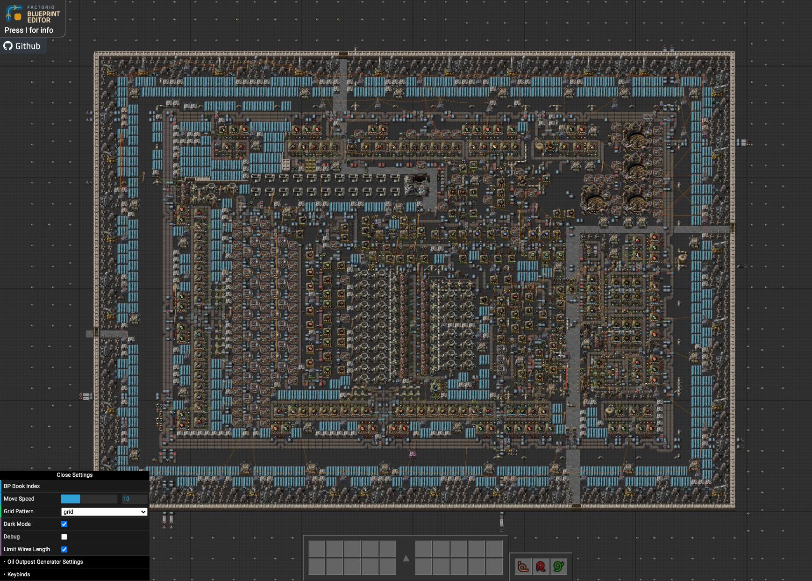

# factorio-blueprint-editor

&nbsp;&nbsp;_Badges are clickable!_

A feature-rich [Factorio](https://www.factorio.com) Blueprint Editor.
You can now edit your blueprints in the browser!

**This is not the same project as `teoxoy/factorio-blueprint-editor`.** It began
as a fork of it, and its author
[stepped away from that project in August 2026](https://github.com/teoxoy/factorio-blueprint-editor/issues/276).
This one is run by different people, under `FactoryGameFan`, with its own logo,
its own issue tracker and its own deployment at <https://fbe.factorygamefan.com>.
It adds Factorio 2.0 and Space Age support. Send bug reports and pull requests
here rather than upstream. The default branch is `wormeyman-space-age-support`,
not `master`.

Sample blueprint: <https://fbe.factorygamefan.com/?source=https://pastebin.com/uc4n81GP>

Example blueprint book: <https://fbe.factorygamefan.com/?source=https://pastebin.com/Xp9u7NaA&index=1>

## Features

- rendering and editing blueprints
- Factorio 2.0 and Space Age entities, tiles and signals
- history (undo/redo)
- copy and delete selections
- import blueprints and books from multiple sources
  (direct bp string, pastebin, hastebin, gist, gitlab, factorioprints,
  factorio.school, factoriobin, google docs)
- generating blueprint images
- oil outpost generator
- customizable keybinds
- "creative" entities
- read-only viewer on mobile, with pan and pinch-to-zoom

## Contributing

Check out [this readme](./CONTRIBUTING.md) if you are interested in contributing.

## Credits

Thanks to [Teoxoy](https://github.com/teoxoy) for building the editor this
project grew out of, and for eight years of work on it.

Thanks to all contributors!

Thanks to everyone who submitted bugs and feature requests on github and doorbell.io!

Thanks to the factorio player GamesDan for reporting a lot of issues via doorbell!
